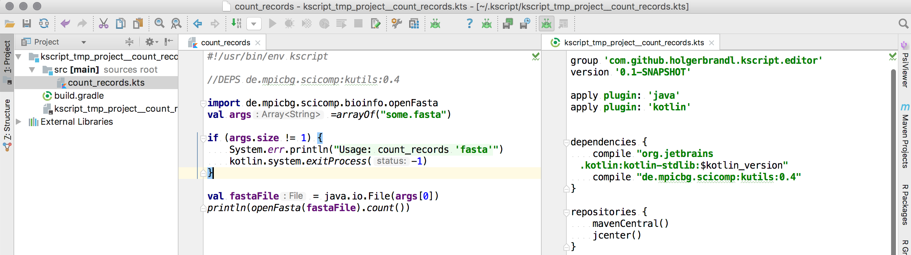

= kscript - Having fun with Kotlin scripting

image:https://img.shields.io/github/release/kscripting/kscript.svg[GitHub release,link=https://github.com/kscripting/kscript/releases]
image:https://github.com/kscripting/kscript/actions/workflows/build.yml/badge.svg[Build Status,link=https://github.com/kscripting/kscript/actions/workflows/build.yml]
image:https://badges.gitter.im/kscripting/kscript.svg[Gitter,link=https://gitter.im/kscripting/kscript?utm_source=badge&utm_medium=badge&utm_campaign=pr-badge]

Enhanced scripting support for https://kotlinlang.org/[Kotlin] on *nix-based and Windows systems.

Kotlin has some built-in support for scripting already, but it is not yet feature-rich enough to be a viable alternative in the shell.

In particular this wrapper around `kotlinc` adds

* Compiled script caching (using md5 checksums)
* Dependency declarations using gradle-style resource locators and automatic dependency resolution
* More options to provide scripts including interpreter mode, reading from stdin, local files or URLs
* Embedded configuration for Kotlin runtime options
* Support library to ease the writing of Kotlin scriptlets
* Deploy scripts as stand-alone binaries

Taken all these features together, `kscript` provides an easy-to-use, very flexible, and almost zero-overhead solution
to write self-contained mini-applications with Kotlin.

*Good News*: Kotlin https://kotlinlang.org/docs/reference/whatsnew14.html#scripting-and-repl[v1.4] finally ships with a much improved - and needed - scripting integration. See https://github.com/Kotlin/kotlin-script-examples/blob/master/jvm/main-kts/MainKts.md[here] for examples and documentation. Still, we think that `kscript` has various benefits compared this new platform-bundled improved toolstack, so we'll plan to support `kscript` until the kotlin platform will ship with an even more rich and versatile kotlin scripting interpreter.

*https://holgerbrandl.github.io/kscript_kotlinconf_2017/kscript_kotlinconf.html[`kscript` presentation from KotlinConf2017!]*

'''
* <<Installation>>
* <<Script Input Modes>>
* <<Script Configuration>>
* <<Text Processing Mode>>
* <<Treat yourself a REPL with `--interactive`>>
* <<Boostrap IDEA from a scriptlet>>
* <<Deploy scripts as standalone binaries>>
* <<Embed kscript installer within your script>>
* <<kscript configuration file>>
* <<FAQ>>
* <<Support>>
* <<How to contribute?>>
* <<Acknowledgements>>

== Installation

To use `kscript` just Kotlin is required.
To https://kotlinlang.org/docs/tutorials/command-line.html[install Kotlin] we
recommend http://sdkman.io/install[sdkman]:

[source,bash]
----
curl -s "https://get.sdkman.io" | bash     # install sdkman
source "$HOME/.sdkman/bin/sdkman-init.sh"  # add sdkman to PATH

sdk install kotlin                         # install Kotlin
----

Once Kotlin is ready, you can install `kscript` with

[source,bash]
----
sdk install kscript
----

To test your installation simply run

[source,bash]
----
kscript --help
----

This will check and inform about updates. To update `kscript` simply install it again as described above.

=== Run with docker

We provide an executable docker container to run `kscript`

[source,bash]
----
# using the latest version of kscript
docker run -i kscripting/kscript 'println("Hello, world!")'

# or using versioned container
docker run -i kscripting/kscript:4.2.0 'println("Hello, world!")'
----

To use a script file outside the container as input, you could do

[source,bash]
----
docker run -i kscripting/kscript - < script.kts
----

This will make `kscript` read the code from stdin while piping the file. Beware that the -i flag is needed to have
stdout redirected outside the container.

Please note, that currently `@Import` are not supported when using a dockerized kscript. Also, any resource outside the
container context may not be resolved correctly. To overcome this limitation, you could use for
instance https://docs.docker.com/storage/bind-mounts/[bind mounts].

=== Installation without `sdkman`

If you have Kotlin already, and you would like to install the latest `kscript` release without using `sdkman`
you can do so by unzipping the https://github.com/kscripting/kscript/releases/latest[latest ] binary release. Don't
forget to update your `$PATH` accordingly.

=== Installation with Homebrew

On MacOS you can install `kscript` also with https://brew.sh/[Homebrew]

[source,bash]
----
brew install kscripting/tap/kscript
----

To upgrade to latest version

[source,bash]
----
brew update
brew upgrade kscripting/tap/kscript
----

=== Installation on Arch Linux

On Arch Linux, `kscript` is available through
the https://aur.archlinux.org/packages/kscript/[Arch Linux User repository (AUR)]. Use your
favorite https://wiki.archlinux.org/index.php/AUR_helpers[AUR helper] to install, e.g. `yay`:

[source,bash]
----
yay -S kscript
----

There is an uncommon directory layout of Kotlin package for Arch Linux, which causes problems when using kscript with
default Kotlin package.
Two workarounds for ArchLinux exists, which can be used to make 'kscript' working with ArchLinux:

. Manually create symlinks in the system…
+
[source,bash]
----
sudo mkdir /usr/share/kotlin/bin
sudo ln -s /usr/bin/kotlin /usr/share/kotlin/bin/kotlin   
sudo ln -s /usr/bin/kotlinc /usr/share/kotlin/bin/kotlinc
----

. …or install Kotlin using SdkMan:
+
<<Installation,Installation using SdkMan>>

The problem should be fixed in the Kotlin package for ArchLinux. See more in the Github issue: +
https://github.com/kscripting/kscript/issues/371

=== Installation on Windows

On Windows, `kscript` is available through
the https://github.com/ScoopInstaller/Extras/blob/master/bucket/kscript.json[Scoop Extras bucket]. Use the following commands to install:

[source,powershell]
----
scoop bucket add extras
scoop install kscript
----

To install `scoop` use the https://github.com/ScoopInstaller/Install[official guide].

=== Build it yourself

To build `kscript` yourself, simply clone the repo and do

[source,bash]
----
./gradlew assemble

## Run kscript from output dir
./build/kscript/bin/kscript
----

== Script Input Modes

The main mode of operation is `kscript <script>`.

The `<script>` can be a Kotlin `*.kts` script file , a script URL, `-` for stdin, a process substitution file handle,
a `*.kt` source file with a main method, or some kotlin code.

=== Interpreter Usage

To use `kscript` as interpreter for a script just point to it in the shebang line of your Kotlin scripts:

[source,kotlin]
----
#!/usr/bin/env kscript

println("Hello from Kotlin!")
for (arg in args) {
    println("arg: $arg")
}
----

=== Inlined Usage

To use `kscript` in a workflow without creating an additional script file, you can also use one of its supported modes
for _inlined usage_. The following modes are supported:

* Directly provide a Kotlin scriptlet as argument

[source,bash]
----
kscript 'println("hello world")'
----

* Pipe a Kotlin snippet into `kscript` and instruct it to read from `stdin` by using `-` as script argument

[source,bash]
----
echo 'println("Hello Kotlin.")' |  kscript -
----

* Using `heredoc` (preferred solution for inlining) which gives you some more flexibility to also use single quotes in your script:

[source,bash]
----
kscript - <<"EOF"
println("It's a beautiful day!")
EOF
----

* Since the piped content is considered as a regular script it can also have dependencies

[source,bash]
----
kscript - <<"EOF"
@file:DependsOn("com.offbytwo:docopt:0.6.0.20150202", "log4j:log4j:1.2.14")

import org.docopt.Docopt
val docopt = Docopt("Usage: jl <command> [options] [<joblist_file>]")

println("hello again")
EOF
----

* Finally, (for sake of completeness), it also works with process substitution and for sure you can always provide
 additional arguments (exposed as `args : Array<String>` within the script)

[source,bash]
----
kscript <(echo 'println("k-onliner")') arg1 arg2 arg3 
----

Inlined _kscripts_ are also cached based on `md5` checksum, so running the same snippet again will use a cached jar (
sitting in `~/.kscript`).

=== URL usage

To support remote scriplet repositories, `kscript` can also work with URLs. Consider the
following https://github.com/kscripting/kscript/blob/master/examples/url_example.kts[hello-world-gist-scriptlet]
which is hosted on github (but any URL would work). To run it locally as a tool simply refer to it (here using the
shortened https://raw.githubusercontent.com/kscripting/kscript/master/examples/url_example.kts[raw-URL] of the
script for better readability)

[source,bash]
----
kscript https://git.io/v1cG6 my argu ments 
----

To streamline the usage, the first part could be even aliased:

[source,bash]
----
alias hello_kscript="kscript https://git.io/v1cG6"
hello_kscript my argu ments
----

Via this mechanism, `kscript` allows for easy integration of remotely hosted (mini) programs into data workflows.

URL-scripts are cached locally to speed up processing, and `kscript --clear-cache` can be used to wipe the cache if
needed.

See this http://holgerbrandl.github.io/kotlin/2016/12/02/mini_programs_with_kotlin.html[blogpost] for a more extensive
overview about URL support in `kscript`.

== Script Configuration

The following directives supported by `kscript` to configure scripts:

* `@file:DependsOn` to declare dependencies with gradle-style locators
* `@file:Import` to source kotlin files into the script
* `@file:EntryPoint` to declare the application entrypoint for kotlin `*.kt` applications
* `@file:CompilerOptions` to configure the compilation options
* `@file:KotlinOptions` to configure the kotlin/java runtime environment

=== Declare dependencies with `@file:DependsOn`

To specify dependencies simply use gradle-style locators. Here's an example
using https://github.com/docopt/docopt.java[docopt] and http://logging.apache.org/log4j/2.x/[log4j]

[source,kotlin]
----
#!/usr/bin/env kscript
@file:DependsOn("com.offbytwo:docopt:0.6.0.20150202", "log4j:log4j:1.2.14")

import org.docopt.Docopt
import java.util.*

val usage = """
Use this cool tool to do cool stuff
Usage: cooltool.kts [options] <igenome> <fastq_files>...

Options:
 --gtf <gtfFile>     Custom gtf file instead of igenome bundled copy
 --pc-only           Use protein coding genes only for mapping and quantification
"""

val doArgs = Docopt(usage).parse(args.toList())

println("Hello from Kotlin!")
println("Parsed script arguments are: \n$doArgs")
----

`kscript` will read dependencies from all lines in a script that start with `@file:DependsOn` (if any). Multiple
dependencies can
be split by comma, space or semicolon.

=== Configure the runtime with `@file:KotlinOptions`

`kscript` allows to provide a `@file:KotlinOptions` directive followed by parameters passed on to `kotlin` similar to
how
dependencies are defined:

[source,kotlin]
----
#!/usr/bin/env kscript
@file:KotlinOptions("-J-Xmx5g", "-J-server")

println("Hello from Kotlin with 5g of heap memory running in server mode!")
----

Note: Similar to the runtime you can also tweak the compile step by providing `@file:CompilerOptions`.

=== Ease prototyping with `@file:Import`

`kscript` supports an `@file:Import` directive to directly include other source files without prior compilation.
Absolute
and relative paths, as well as URLs are supported. Example:

[source,kotlin]
----
//utils.kt
fun Array<Double>.median(): Double {
    val (lower, upper) = sorted().let { take(size / 2) to takeLast(size / 2) }
    return if (size % 2 == 0) (lower.last() + upper.first()) / 2.0 else upper.first()
}
----

Which can be now used using the `@file:Import` directive with

[source,kotlin]
----
#!/usr/bin/env kscript

@file:Import("utils.kt")

val robustMean = listOf(1.3, 42.3, 7.0).median()
println(robustMean)
----

The argument can be an URL, absolute or relative file path. Note that URLs used in include directives are cached locally
to speed up processing, that is `kscript` won't fetch URLs again unless the user actively clears the cache
with `kscript --clear-cache`.

For more examples see link:test/resources/includes/include_variations.kts[here].

=== Use `@file:EntryPoint` to run applications with `main` method

`kscript` also supports running regular Kotlin `kt` files.

Example: `./examples/Foo.kt`:

[source,kotlin]
----
package examples

@file:EntryPoint("examples.Bar")

class Bar {
    companion object {
        @JvmStatic
        fun main(args: Array<String>) {
            println("Foo was called")
        }
    }
}

fun main(args: Array<String>) = println("main was called")
----

To run top-level main instead we would use `@file:EntryPoint(&quot;examples.FooKt&quot;)`

The latter is the default for `kt` files and could be omitted

=== Examples of annotation driven configuration

[source,kotlin]
----
#!/usr/bin/env kscript

// Declare dependencies
@file:DependsOn("com.github.holgerbrandl:kutils:0.12")
@file:DependsOn("com.beust:klaxon:0.24", "com.github.kittinunf.fuel:fuel:2.3.1")

// To use a custom maven repository you can declare it with
@file:Repository("http://maven.imagej.net/content/repositories/releases")

// For compatibility with https://github.com/ligee/kotlin-jupyter kscript supports also
@file:DependsOnMaven("net.clearvolume:cleargl:2.0.1")
// Note that for compatibility reasons, only one locator argument is allowed for @DependsOnMaven

// also protected artifact repositories are supported, see <https://github.com/kscripting/kscript/blob/master/test/TestsReadme.md#manual-testing>
// @file:Repository("my-art", "http://localhost:8081/artifactory/authenticated_repo", user="auth_user", password="password")
// You can use environment variables for user and password when string surrounded by double {} brackets 
// @file:Repository("my-art", "http://localhost:8081/artifactory/authenticated_repo", user="{{ARTIFACTORY_USER}}", password="{{ARTIFACTORY_PASSWORD}}")
// will be use 'ARTIFACTORY_USER' and 'ARTIFACTORY_PASSWORD' environment variables
// if the value doesn't found in the script environment  will fail

// Include helper scripts without deployment or prior compilation
@file:Import("util.kt")

// Define kotlin options
@file:KotlinOptions("-J-Xmx5g")
@file:KotlinOptions("-J-server")
@file:CompilerOptions("-jvm-target 1.8")

// declare application entry point (applies on for kt-files)
@file:EntryPoint("Foo.bar")

print("1+1")
----

To enable the use of these annotations in Intellij, the user must add the following artifact to the project
dependencies:

----
io.github.kscripting:kscript-annotations:1.5
----

`kscript` will automatically detect an annotation-driven script, and if so will declare a dependency on this artifact
internally.

Note, that if a script is located in a package other than the root package, you need to import the annotations with (
e.g. `import DependsOn`).

== Text Processing Mode

`kscript` can be used as a speedier and more flexible substitute for built-in terminal text tools such as `awk` or `sed`
. Its text processing mode can be enabled with `-t` or `--text`. If so, `kscript` will

* Declare `com.github.kscripting:kscript-support-api:1.2.5` as dependency for the script.
 This https://github.com/kscripting/kscript-support-api[support library] eases the writing of Kotlin scriptlets for
 text-processing. It includes solutions to common use-cases like argument parsing, data streaming, IO utilities, and
 various iterators to streamline the writing of scriptlets for text processing.
* Import the `kscript.*` namespace
* Define variable `val lines = kscript.text.resolveArgFile(args)` which returns an iterator over the lines in the first
 input argument of the script, or the standard input if no file arguments are provided to the script

This allows to replace `awk`ward constructs (or `sed` or`perl`) with _kotlinesque_ solutions such as

[source,bash]
----
cat some_file | kscript -t 'lines
    .filter { "^de0[-0]*".toRegex().matches(it) }
    .map { it + "foo:" }
    .print()
'
----

In this example, the extension
method https://github.com/kscripting/kscript-support-api/blob/master/src/main/kotlin/kscript/text/StreamUtil.kt#L34[`Iterable<String>.print()`]
to print the lines to stdout comes from the support API. The rest is stdlib Kotlin.

For more examples using the support library see
this http://holgerbrandl.github.io/kotlin/2017/05/08/kscript_as_awk_substitute.html[blog post].

== Treat yourself a REPL with `--interactive`

To create an interactive kotlin shell (
aka https://kotlinlang.org/docs/tutorials/command-line.html#running-the-repl[REPL]) with all script dependencies added
to the classpath you can use `--interactive`.

For example, let's assume the following short script, named `CountRecords.kts`

[source,kotlin]
----
#!/usr/bin/env kscript
@file:DependsOn("com.github.holgerbrandl:kutils:0.12")

import de.mpicbg.scicomp.bioinfo.openFasta

if (args.size != 1) {
    System.err.println("Usage: CountRecords <fasta>")
    kotlin.system.exitProcess(-1)
}

val records = openFasta(java.io.File(args[0]))
println(records.count())
----

To build a REPL that has the declared artifact in its classpath, we can just do

[source,bash]
----
kscript --interactive CountRecords.kts
----

which will bring up the classpath-enhanced REPL:

----
Creating REPL from CountRecords.kts
Welcome to Kotlin version 1.1.51 (JRE 1.8.0_151-b12)
>>> import de.mpicbg.scicomp.bioinfo.openFasta
>>> 
----

== Boostrap IDEA from a scriptlet

Artifacts and versions will differ between scripts, so it is hard to maintain them all in a single project. To
nevertheless provide optimal tooling when scripting with Kotlin `kscript` allows to create temporary projects
for `<script>` arguments.

[source,bash]
----
kscript --idea CountRecords.kts
----

If you have available `gradle` in the path project will be automatically built and if there is `idea` in the path
the project will be opened in https://www.jetbrains.com/idea/[IntelliJ IDEA] with a minimalistic project containing
just your (1) `<script>` and (2) a generated `build.gradle.kts` file:

The `idea` command line launcher can can be created in IntelliJ with `Create Command-line Launcher` command, or you can
set the command used to launch your IntelliJ as `KSCRIPT_COMMAND_IDEA` env property. Similarly, you can set `gradle`
command using `KSCRIPT_COMMAND_GRADLE` env property.

== Deploy scripts as standalone binaries

To deploy a script simply do

[source,bash]
----
kscript --package some_script.kts
./some_script --arg u ments
----

The created binary will contain a compiled copy of the script, as well as all declared dependencies (fatjar). Also
runtime jvm parameters declared via `@file:KotlinOptions` are used to spin up the JVM.

Just `java` is required to run these binaries.

== Embed kscript installer within your script

To make a script automatically <<Installation,install kscript>> and its dependencies on first run if necessary, run:

[source,bash]
----
kscript --add-bootstrap-header some_script.kts
----

Now `some_script.kts` can be shared and run directly on any other machine that has `bash`, without having to go through
the <<Installation>> steps first.

Note that unlike the <<Deploy scripts as standalone binaries,`--package` option>> this doesn't produce a separate file,
allowing the distributed script to be read and modified(including
with <<Boostrap IDEA from a scriptlet,`kscript --idea`>>) similar to what you might expect with bash/python/ruby
scripts.
On the other hand this doesn't embed dependencies within the script("fat jar"), so internet connection may be required
on its first run.

== kscript configuration file

To keep some options stored permanently in configuration you can create kscript configuration file.

KScript follows XDG directory standard, so the file should be created in (paths are resolved in provided order; first
existing path is used):

|===
|OS |PATH 

|*Windows* | %LOCALAPPDATA%\kscript\kscript.properties; %USERPROFILE%.config\kscript\kscript.properties
|*MacOs*   | ~/Library/Application Support/kscript/kscript.properties;
|*Posix*   | \${XDG_CONFIG_DIR}/kscript/kscript.properties; \${user.home}/.config/kscript/kscript.properties
|===

If the environment variable: *KSCRIPT_DIRECTORY* is defined the configuration file 'kscript.properties' will be placed
directly inside it.

Content of kscript.properties file is a standard Java format, with following properties available:

----
scripting.preamble=
scripting.kotlin.opts=
scripting.repository.url=
scripting.repository.user=
scripting.repository.password=
scripting.directory.artifacts=
----

Example configuration file:

----
scripting.preamble=// declare dependencies\n\
@file:DependsOn("com.github.holgerbrandl:kutils:0.12")\n\
\n\
// make sure to also support includes in here\n\
// @file:Import("util.kt")\n\
@file:Import("https://raw.githubusercontent.com/kscripting/kscript/master/test/resources/custom_dsl/test_dsl_include.kt")\n\
\n\
\n\
// define some important variables to be used throughout the dsl\n\
val foo = "bar"

scripting.kotlin.opts=-J-Xmx4g
scripting.repository.url=https://repository.example
scripting.repository.user=user
scripting.repository.password=password
----

== FAQ

=== How to edit kscript in VS Code?

See https://magnusgunnarsson.se/offentlig/kscript-in-visual-studio-code-vsc/ for a walkthrough and the required editor
configuration.

=== Why is `kscript` not calling the main method in my `.kts` script?

There is https://kotlinlang.org/docs/tutorials/command-line.html#using-the-command-line-to-run-scripts[no need] for
a `main` method in a Kotlin script. Kotlin `*.kts` scripts can be more simplistic compared to more common kotlin `*.kt`
source files. The former work without a `main` method by directly running the provided code from top to bottom. E.g.

----
print("hello kotlin!")
----

is a valid Kotlin `kts` script. Plain and simple, no `main`, no `companion`, just a few bits of code.

=== Does `kscript` also work for regular kotlin `.kt` source files with a `main` as entry point?

Yes, (since kscript v1.6) you can run kotlin source files through `kscript`. By default, it will assume a
top-level `main` method
as entry-point.

However, in case you're using a companion object to declare the entry point, you need to indicate this via
the `@file:Entry`.

=== What are performance and resource usage difference between scripting with kotlin and python?

Kotlin is a compiled language, so there is a compilation overhead when you run a script/application written in Kotlin
for the first time.

Kotlin runs (mainly) on the JVM which needs some time (~200ms) to start up. In contrast, the python interpreter has
close to zero warmup time.

I think there is a consensus that JVM programs execute much faster than python equivalents. Still, python might be
faster depending on your specific usecase. Also, with kotlin-native becoming more mature, you could compile into native
binaries directly, which should bring it close to C/C++ performance.

Main motivations for using Kotlin over Python for scripting and development are

* Kotlin is the better designed, more fluent language with much better tooling around it
* The JVM dependency ecosystem allows for strict versioning. No more messing around with virtualenv, e.g. to run a short
 10liner against a specific version of numpy.

=== Does kscript work with java?

The only language supported by `kscript` is kotlin. For a similar approach centering around Java scripting
see https://github.com/maxandersen/jbang[jbang].

=== Can I use custom artifact repositories?

Yes, via the `@Repository` annotation. See <<Script Configuration,annotations section>>
or link:test/resources/custom_mvn_repo_annot.kts[custom_mvn_repo_annot] for a complete example

== Support

Feel welcome to post ideas and suggestions to our https://github.com/kscripting/kscript/issues[tracker].

More advanced use-cases are documented in the link:docs/user_guide.md[complementary user guide]

== How to contribute?

We always welcome pull requests and trouble tickets. :-)

Help to spread the word. Great community articles about `kscript` include

* https://medium.com/@OhadShai/type-safety-in-the-shell-with-kscript-7dd40d022537[Type-safety in the shell with kscript]
* https://medium.com/@kenkyee/using-kotlin-kscript-for-preprocessing-data-1dbff4eae292[Using Kotlin kscript for Preprocessing Data]
* https://holgerbrandl.github.io/kotlin/2017/05/08/kscript_as_awk_substitute.html[kscript as substitute for awk]
* https://hackernoon.com/a-complete-backend-only-with-kotlin-and-your-favourite-text-editor-582b4528688[A complete backend with Kotlin and your favourite text-editor]
 -using kscript

You could also show your support by upvoting `kscript` here on github, or by voting for issues in Intellij IDEA which
impact `kscript`ing. Here are our top 2 tickets/annoyances that we would love to see fixed:

* https://youtrack.jetbrains.com/issue/KT-13347[KT-13347] Good code is red in injected kotlin language snippets

To allow for more interactive script development, you could also vote/comment on the most annoying REPL issues.

* https://youtrack.jetbrains.net/issue/KT-24789[KT-24789] "Unresolved reference" when running a script which is a
 symlink to a script outside of source roots
* https://youtrack.jetbrains.com/issue/KT-12583[KT-12583] IDE REPL should run in project root directory
* https://youtrack.jetbrains.com/issue/KT-11409[KT-11409] Allow to "Send Selection To Kotlin Console"

== Acknowledgements

The initial version of `kscript` was kindly contributed by https://github.com/oskargb[Oscar Gonzalez].

Special thanks to https://github.com/ilanpillemer[Ilan Pillemer], https://github.com/gildor[Andrey Mischenko ]
, https://github.com/stephenbyrne-mfj[Stephen Byrne], https://github.com/EugeneSusla[Eugene Susla]
, https://github.com/elihart[Eli Hart], https://github.com/hj-lee[Hwijae Lee] and https://github.com/oshai[oshai]
for https://github.com/kscripting/kscript/graphs/contributors[contributing] PRs to this repo.

Thanks also to the https://www.scionics.com/[Scionics Computer Innovation GmbH] and
the http://www.mpi-cbg.de[MPI-CBG] for supporting this project.

Version 3.1 to 4.0 rewrite and current maintenance by https://github.com/aartiPl/[Marcin Kuszczak]

`kscript` was inspired by https://github.com/andrewoma/kotlin-script[kotlin-script] which is another great way (now
deprecated) to do scripting in Kotlin.
