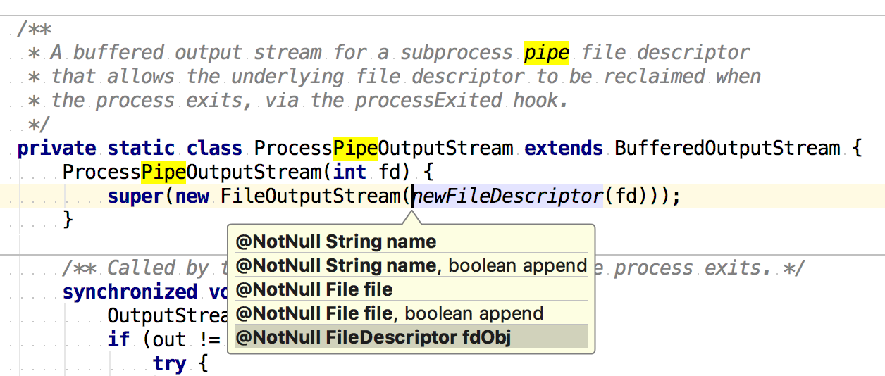

## KEEP Kotlin Scripting support

From

https://blog.jetbrains.com/kotlin/2018/06/kotlin-1-2-50-is-out/

* it is now possible to create a jar defining a script and if that jar is added to the compilation classpath, the scripts of this type will be automatically supported by the compiler and IDEA plugin
* it is now possible to pass typed external variables to the script compilation, so they will be accessible as if they are global variables defined outside of the script
* the structure of the scripting support is now much simpler and provided helpers allow to implement and embed a custom scripting host much easier than before


## macos setup

change java version
https://stackoverflow.com/questions/21964709/how-to-set-or-change-the-default-java-jdk-version-on-os-x

```
export JAVA_HOME=`/usr/libexec/java_home -v 9.0.1`
export JAVA_HOME=`/usr/libexec/java_home -v 1.8.0_151`
```

## launcher

https://stackoverflow.com/questions/59895/getting-the-source-directory-of-a-bash-script-from-within

Kotlin wrapper class
```

class Wrapper{
    companion object {
        @JvmStatic
        fun main(args: Array<String>) {
            val script = Wrapper::class.java.classLoader.loadClass("Wrapper")
            script.getDeclaredConstructor().newInstance(args);
        }
    }
}
```

## dependency declarations

kotlin [jupyter kernel ](https://github.com/ligee/kotlin-jupyter/blob/6ec1e5f8e4fc0a8ce0015194518275201fd5f3eb/readme.md)supports

* `@file:DependsOnJar(<relative|absolute-path-in-dir-repo>)` - adds a class directory or jar to the classpath
* `@file:DirRepository(<absolute-path>)` - adds a directory as a repo
* `@file:DependsOnMaven(<colon-separated-maven-coordinates>)` - resolves artifacts using maven, downloads them if necessary, and adds to the classpath
* `@file:MavenRepository(<mavenRepoUrl>)` - adds a maven repository

which seem to come from https://github.com/kohesive/keplin//keplin-maven-resolver/src/main/kotlin/uy/kohesive/keplin/kotlin/script/resolver/maven/MavenResolverAnnotations.kt


They also have impl a programmatic mvn resolver there https://github.com/kohesive/keplin/blob/master/keplin-maven-resolver/src/main/kotlin/uy/kohesive/keplin/kotlin/script/resolver/maven/MavenScriptDependenciesResolver.kt

Could be used as a library, see
https://github.com/kohesive/keplin#keplin-core


tbd: What is included in `compile "org.jetbrains.kotlin:kotlin-annotations-jvm:1.1.60"`

## References

http://stackoverflow.com/questions/21814652/how-to-download-dependencies-in-gradle


```
apply plugin: 'java'

dependencies {
  runtime group: 'com.netflix.exhibitor', name: 'exhibitor-standalone', version: '1.5.2'
  runtime group: 'org.apache.zookeeper',  name: 'zookeeper', version: '3.4.6'
}

repositories { mavenCentral() }

task getDeps(type: Copy) {
  from sourceSets.main.runtimeClasspath
  into 'runtime/'
}
```
Download the dependencies (and their dependencies) into the folder runtime when you execute `./gradlew getDeps`.


https://github.com/andrewoma/kotlin-scripting-kickstarter

Kotlin natively supports scripting to a limited extent, so it is valid to use #! (shebang) directives at the top of kotlin source files.


## mvncp
https://github.com/andrewoma/kotlin-script/blob/master/extras/mvncp


https://github.com/andrewoma/kotlin-script

Installation
```bash
curl -s https://raw.githubusercontent.com/andrewoma/kotlin-script/master/extras/mvncp > ~/bin/mvncp && chmod u+x ~/bin/mvncp

```
Example
```
mvncp com.offbytwo:docopt:0.6.0.20150202  2> /dev/null
mvncp org.docopt:docopt:0.6.0-SNAPSHOT  2> /dev/null
```

## Official Docs

https://kotlinlang.org/docs/tutorials/command-line.html#using-the-command-line-to-run-scripts

kotlinc -script list_folders.kts

## misc

tmp dir on all platforms : http://unix.stackexchange.com/questions/174817/finding-the-correct-tmp-dir-on-multiple-platforms
> Just use ${TMPDIR-/tmp} on Unix-likes. TMPDIR is there (by the system or administrator or user) to tell you when not to use /tmp for temporary files

## Changes in Kotlin v1.1

Additional kotlin-script-runtime.jar is needed 
* https://youtrack.jetbrains.com/issue/KT-16562
* https://github.com/Kotlin/KEEP/blob/master/proposals/script-definition-template.md

## Misc

for dependency resolution also consider
http://stackoverflow.com/questions/9407554/sbt-alternative-to-mvn-install-dskiptests

Create a sinlge jar containing all dependencies (to ease deployment for non-published dependencies)

## kotlinc shebang config

http://unix.stackexchange.com/questions/20880/how-can-i-use-environment-variables-in-my-shebang

Shebang lines do not undergo variable expansion, so you cannot use $FOO/MyCustomPython as it would search for an executable named dollar-F-O-O-...


http://www.unix.com/shell-programming-and-scripting/44511-environment-variables-shebangs.html


## Caching

http://stackoverflow.com/questions/12487424/uppercase-first-character-in-a-variable-with-bash
https://youtrack.jetbrains.com/issue/KT-10533

## Why not use env?
http://www.in-ulm.de/~mascheck/various/shebang/#interpreter-script

Most probably there isn't any Bell-Labs- or Berkeley-derived Unix that accepts the interpreter to be a script, which starts with #! again.
However, Linux since 2.6.27.9 2 and Minix accept this.

Also see https://en.wikipedia.org/wiki/Shebang_(Unix)#Portability

 Some systems, including Linux, do not split up the arguments;[10] for example, when running the script with the first line like,

Also see http://stackoverflow.com/questions/4303128/how-to-use-multiple-arguments-with-a-shebang-i-e


## directly run scripts with kotlinc

```
## directly run the script...
echo kotlinc -script -classpath "$classpath" "$@"

```

## how does process substitution work?

http://unix.stackexchange.com/questions/156084/why-does-process-substitution-result-in-a-file-called-dev-fd-63-which-is-a-pipe

When you do `<(some_command)`, your shell executes the command inside the parentheses and replaces the whole thing with a file descriptor, that is connected to the command's stdout. So `/dev/fd/63` is a pipe containing the output of your ls call.


https://unix.stackexchange.com/questions/153896/bash-process-substitution-and-stdin

Related Projects
----------------

* [coursier](https://github.com/alexarchambault/coursier) - Pure Scala Artifact Fetching. Potential more powerful replacement for `resdeps.kts`
* [kotlin-script](https://github.com/andrewoma/kotlin-script) - Support for using Kotlin as a scripting language


Suprocess management
--------------------

buffer handling is limited with standard jdk ProcessBuilder because buffer is limit and will block once full.


JDK aims to improve it https://www.javaworld.com/article/3176874/java-language/java-9s-other-new-enhancements-part-3.html